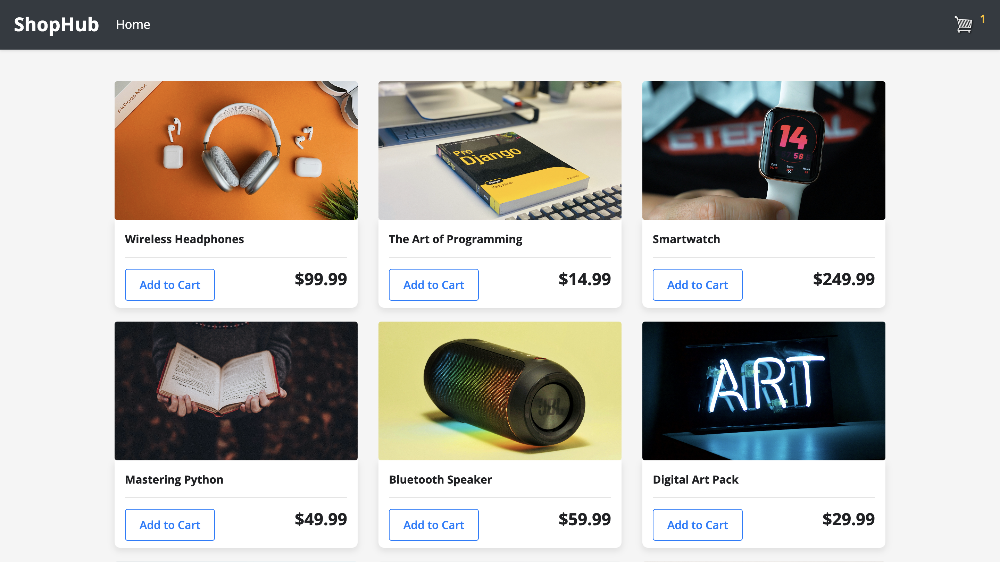
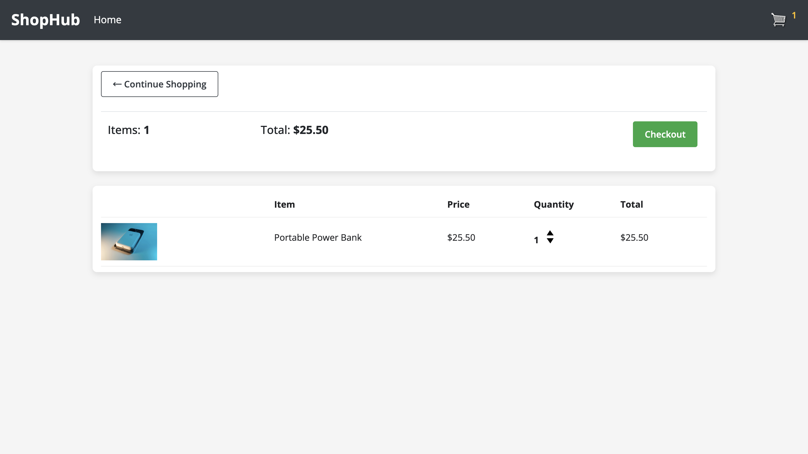
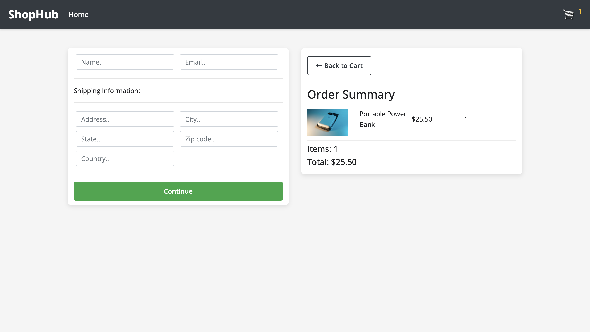

# ShopHub

ShopHub is an eCommerce web application built with Django. The project includes features such as product listing, cart management, and order processing. It uses a SQLite database for data storage and Amazon S3 for media file management. This project is deployed on [Railway](https://railway.app/).

## Website

You can view the website by clicking the link below:

[Click here to view the website](https://shophub.up.railway.app/)

## Screenshots

## PayPal Integration

This project integrates with PayPal for processing payments. The PayPal API is set up in sandbox mode, which allows for testing without actual transactions.

## Technologies Used

- **Django** - The web framework used to build the application.
- **SQLite3** - The database used for data storage.
- **Amazon S3** - For media file storage.
- **Whitenoise** - For serving static files in production.
- **CORS Headers** - To handle cross-origin resource sharing.

